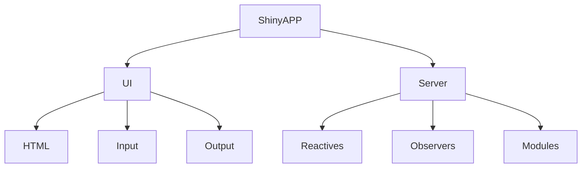

# MIE2024 Masterclass R & Shiny

## Introduction

At the MIE2024 conference, we presented a brief masterclass on R and Shiny. The masterclass was aimed at researchers working primarily with survey data. As we anticipated, two 45min sessions were hardly sufficient to cover all relevant topics in sufficient depth. We therefore decided to make our code examples public in the form of an R Package.

Topics covered: 

<ul>
<li>R in a production environment</li>
<li>Plotting charts with Plotly</li>
<li>Shiny fundamentals</li> 
</ul>

Feel free to contact the package maintainer ([david\@dataim.nl](mailto:david@dataim.nl){.email}) for any technical matters or follow-up questions.

## Getting started with the MIE2024 package

<details>

<summary>Clone the package or download the package ZIP file</summary>

Traditional git clone:

```         
git clone https://github.com/DataIMLabs/MIE2024/
```

Github clone via GitHub's command line interface (CLI):

```         
gh repo clone DataIMLabs/MIE2024
```

Zip download: [<https://github.com/DataIMLabs/MIE2024/archive/refs/heads/main.zip>]

</summary>

</details>

<details>

<summary>Install package requirements (if needed)</summary>

Most likely, the following packages are already installed. 
If not, run the code below to install the required dependencies

``` r
install.packages("plotly")
install.packages("shiny")
install.packages("data.table")
install.packages("magrittr")
install.packages("ggplot2")
install.packages("devtools")
install.packages("purrr")
install.packages("rlang")
```

</details>


## R in a production environment

### Data handling 

We strongly favor data.table syntax instead of traditional base R code or tidyverse syntax for data handling. 

See the examples in examples/dh to illustrate: 

### Plotting

```R

 plot_ly(dt,
    x      = ~type, 
    y      = ~counts, 
    type   = 'bar',
    marker = list(
        color = 'rgba(55, 128, 191, 0.6)',
        line  = list(color = 'rgba(55, 128, 191, 1.0)', width = 1.5))
    ) %>% 
    layout(
        title = list(text = ''),
        xaxis = list(title = 'User type'),
        yaxis = list(title = 'Aantal')
    )

```


## Shiny fundamentals
A Shiny APP comprises the following parts: 



<details>

<summary>Basic structure of a Shiny APP</summary>


``` R
library(shiny)

ui <- fluidPage(
    textOutput(outputId = "text")
)

server <- function(input, output, session) {
    
    output$text <- renderText({
        "Hallo MIE2024"
    })
}

shinyApp(ui, server) 
```

</details>
 
 
 
