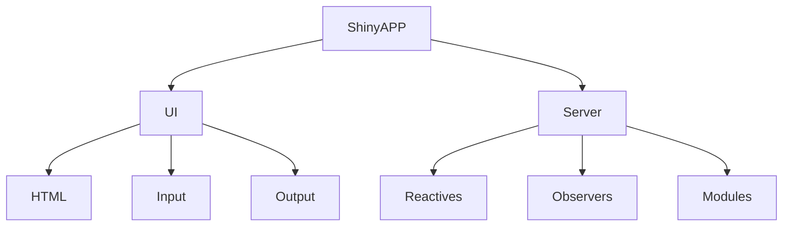

# MIE2024 Masterclass R & Shiny

## Introduction

At the MIE2024 conference, we presented a brief masterclass on R and Shiny. The masterclass was aimed at researchers working primarily with R in the context of analysing (market) research data (i.e., survey data). We assumed that most attendees had at least a basic understanding of statistics (descriptive and inferential) and that many had worked with R or Python before.  

As we anticipated, two 45min sessions were hardly sufficient to cover all relevant topics in sufficient depth. We therefore decided to make our code examples public in the form of an R Package. Furthermore, a more in-depth introductory course in R and Shiny will be released in the next weeks. 

Topics covered in this master class:

<ul>
<li>R in a production environment
    <ul>
        <li>Data handling</li>
        <li>Charting</li>
    </ul>
</li>
<li>Shiny fundamentals
    <ul>
        <li>ShinyAPP = UI + Server</li>
        <li>Reactivity and Observers</li>
        <li>Modules</li>
    </ul>
</li> 
</ul>

Feel free to contact the package maintainer [david@dataim.nl](mailto:david@dataim.nl) for any technical matters or follow-up questions.

## Getting started with the MIE2024 package

<details>
<summary>Install R, RTools and RStudio</summary>

Download and install the following toolchain (in order):

For windows: 

<ol>
    <li>
        [R](https://cran.r-project.org/bin/windows/base/)
    </li>
    <li>
        [RTools](https://cran.r-project.org/bin/windows/Rtools/)
    </li>
    <li>
        [RStudio Desktop](https://posit.co/download/rstudio-desktop/)
    </li>
</ol>

</details>


<details>
<summary>Clone the package or download the package ZIP file</summary>

Traditional git clone:

```         
git clone https://github.com/DataIMLabs/MIE2024/
```

Github clone via GitHub's command line interface (CLI):

```         
gh repo clone DataIMLabs/MIE2024
```

Zip download: [<https://github.com/DataIMLabs/MIE2024/archive/refs/heads/main.zip>]

</summary>
</details>

<details>
<summary>Install package requirements (if needed)</summary>

Most likely, the following packages are already installed. 
If not, run the code below to install the required dependencies

``` r
install.packages("plotly")
install.packages("shiny")
install.packages("data.table")
install.packages("magrittr")
install.packages("ggplot2")
install.packages("devtools")
install.packages("purrr")
install.packages("rlang")
```

</details>


## 1. R in a production environment 

<details>
<summary>Stand-alone scripts vs R Packages</summary>

In a production environment, having a standardized way of organizing source code can save a lot of time. There are generally two ways of organizing R code, namely (a) stand alone script files and (b) a package. We strongly favor the package approach for anything that is more than a simple example. Next, we outline the main differences: 

**R as a scripting tool.** 
Using R as a scripting tool typically involves writing stand-alone script files executed in a sequential manner. Such scripts often start with library statements at the top to load necessary packages, followed by a mix of data manipulation, analysis, and visualization commands. This approach is suited for data analysis tasks where the workflow is linear, and the code is not intended for reuse or distribution. The audience for script files is generally analysts or data scientists who are conducting exploratory data analysis or developing a proof of concept.
 
**Organizing code in an R package.**
In contrast, making an R Package involves structuring R code, documentation, and data in a standardized format, enabling code reuse, sharing, and distribution. R packages include namespaces to manage function names and avoid conflicts, and they require documentation for each exported function, making the code easier to understand and use by others. Packages may also contain tests to ensure code reliability and vignettes for in-depth examples. The package methodology targets a broader audience, including developers and end-users looking for reliable and reusable R functions or sets of functions for specific tasks.
 
The advantages of using the package methodology include enhanced code organization, ease of maintenance, and the ability to share your work with a wider community. Packages facilitate collaboration among developers and ensure that code can be easily updated and extended. Additionally, the use of packages promotes best practices in programming and software development, contributing to the overall quality and robustness of R code in the community.

Further reading: 

[https://r-pkgs.org/]


</details>


<details>
<summary>Data handling </summary>
Base R, tidyverse, and data.table are three prominent ecosystems in R for data manipulation and analysis, each catering to different preferences and requirements.

Base R comes with R itself and providing a wide range of tools for statistical analysis, graphics, and general programming. Its audience includes statisticians, researchers, and R programmers who prefer a more traditional approach to data manipulation and analysis. The syntax in base R can be less intuitive for complex data manipulation tasks but offers a solid foundation for statistical analysis.

The tidyverse, on the other hand, is a collection of R packages designed for data science, offering a coherent and fluent syntax to wrangle, analyze, and visualize data. Its core packages, like dplyr for data manipulation and ggplot2 for data visualization, follow a consistent philosophy centered around tidy data. The tidyverse is particularly popular among data scientists and analysts who prioritize readability and ease of use, making it ideal for those new to R or data science.

Data.table excels in performance, particularly for large datasets, due to its design and programming paradigm that minimizes memory usage and optimizes execution speed. Its syntax, while powerful, has a steeper learning curve, which can be a barrier for new users but is highly valued by those working with large data sets where execution speed is critical. The primary audience for data.table includes data analysts, statisticians, and data engineers who require the high-performance computing capabilities it offers for big data tasks.

Further reading: 

<ul>
 <li>the example scripts in the examples/dh folder of the MIE2024 package.</li>
 <li>[Comparison between base, tidy and data.table](https://jtr13.github.io/cc21fall2/comparison-among-base-r-tidyverse-and-datatable.html])</li>
</ul>

</details>
 
<details>
<summary>Plotting charts</summary>

```R

 plot_ly(dt,
    x      = ~type, 
    y      = ~counts, 
    type   = 'bar',
    marker = list(
        color = 'rgba(55, 128, 191, 0.6)',
        line  = list(color = 'rgba(55, 128, 191, 1.0)', width = 1.5))
    ) %>% 
    layout(
        title = list(text = ''),
        xaxis = list(title = 'User type'),
        yaxis = list(title = 'Aantal')
    )

```
</details>

## 2. Shiny fundamentals

Shiny is a web application framework for R, allowing users to build interactive web applications directly from R. Shiny provides an extensive range of tools to create dynamic user interfaces in which users can interact with their data and visualizations in real-time. Shiny applications are highly versatile, ranging from simple data summaries to complex data analyses and visual models.

The core advantage of Shiny is its ability to enable R users&emdash;who may not have web development experience&emdash;to deploy analyses or models as applications that can be shared on the web. This makes analytical results accessible to a broader audience, without requiring them to run R code locally.

Shiny applications are built around two main components, namely the user interface (UI), which controls the layout and appearance of the app, and the server which includes the instructions to build the app's reactive (output) elements based on user input. 
 


<details>
<summary>Basic structure of a Shiny APP</summary>


``` R
library(shiny)

ui <- fluidPage(
    # Show the user interface
)

server <- function(input, output, session) {
    # Perform logic on input and output
}

shinyApp(ui, server) 
```

</details>

 
 
